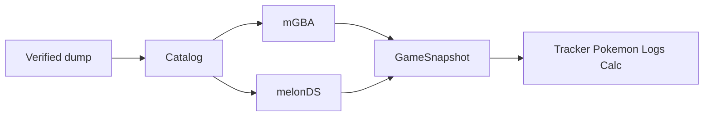

<p align="center">
  
</p>

<h1 align="center">Emulocke</h1>

<p align="center">A desktop Pokémon nuzlocke kit. Game on the left; tracker, party, logs, and calc on the right.</p>

<p align="center">
  <a href="https://github.com/oliverjohnclegg/emulocke/blob/main/LICENSE"></a>
  <a href="https://github.com/oliverjohnclegg/emulocke/actions"></a>
  <a href="https://github.com/oliverjohnclegg/emulocke/stargazers"></a>
</p>

## What is this?

Emulocke is a native desktop host for Pokémon nuzlockes on GBA and DS dumps. You import a verified baseline and start a run. The game stays in the same window as the suite, so you aren't alt-tabbing to a browser tracker.

Features that help a nuzlocke will keep showing up in the right pane. General emulator extras that don't directly contribute to that experience aren't a priority.

## Credits

GBA execution is [mGBA](https://github.com/mgba-emu/mgba) (MPL-2.0). Those files stay MPL; they are not relicensed as GPL. DS execution is [melonDS](https://github.com/melonDS-emu/melonDS) (GPL-3.0-or-later), which is why Emulocke itself is GPL-3.0-or-later.

The cores pick themselves from the dump extension. The UI doesn't split "GBA vs DS" as a product. DS boots with FreeBIOS and generated firmware, so you don't dump Nintendo BIOS. Windowing, audio, and input are SDL3. The suite chrome is Dear ImGui. Hack runs apply bundled IPS/UPS/BPS/xdelta with vendored xdelta3. Damage math follows the MIT Smogon calculator as used by Dynamic-Calc; Fire Red / Leaf Green trainer tables come from [pret/pokefirered](https://github.com/pret/pokefirered).

## How this repo is built

A lot of the tree is written by AI agents, and that is a choice: if you won't run software built that way, don't. Agent PRs are allowed. They don't merge until a human maintainer has read the diff and GitHub Actions is green.

Nobody commits onto `main` or `dev`, including the maintainer. Work lives on a feature or bugfix branch, then a pull request. Outsiders open those against `dev` (Vanguard). `main` is Stable and maintainer-only; a PR aimed at `main` from anyone else is closed.

## Trust

Dumps, saves, patches, network PNGs, prefs, and emulator RAM are untrusted. Unknown SHA-1 files are refused. Parsers are size-capped and bounds-checked. Checksums fail closed.

Every PR runs Ubuntu and Windows Release plus `ctest`, then ASan+UBSan, clang-tidy, and 60s of libFuzzer on the patch and save parsers. A Vanguard or Stable zip is not published unless those jobs pass. The 14 September 2026 write-up, including the 21 closed findings, is [docs/security/audit-2026-09-14.md](docs/security/audit-2026-09-14.md).

A crafted dump, save, patch, PNG, or prefs file that crashes the host or corrupts memory is a vulnerability: email, not a public issue. See [SECURITY.md](SECURITY.md). Crashes in normal play, wrong tracker facts, and "this title won't import" go in [GitHub Issues](https://github.com/oliverjohnclegg/emulocke/issues). Include OS, the window caption (Vanguard commit or Stable version), and the catalog title. Don't attach ROMs or saves.

## Supported titles

US dumps. Unknown SHA-1 files are refused. Tracker atlases cover every catalog row. The Calculator pack is Fire Red / Leaf Green only; Radical Red and Unbound stay without a pack until version-matched tables exist.

### Baseline games

- Pokémon Ruby (Rev 2)
- Pokémon Ruby 1.1
- Pokémon Sapphire (Rev 2)
- Pokémon Emerald
- Pokémon Fire Red 1.0
- Pokémon Fire Red 1.1
- Pokémon Leaf Green 1.0
- Pokémon Leaf Green 1.1
- Pokémon Diamond
- Pokémon Pearl
- Pokémon Platinum
- Pokémon Platinum 1.1
- Pokémon HeartGold
- Pokémon SoulSilver
- Pokémon Black
- Pokémon White
- Pokémon Black 2
- Pokémon White 2

### ROM hacks

You import the baseline the hack depends on. Emulocke already ships the patch, so you don't bring a patched ROM. Sacred Gold, Renegade Platinum, and Volt White 2 Redux ship the pChal Discord QoL patches (Kalaay): less grinding, plus a few pChal-directed balance changes for the Drayano gauntlet.

- Pokémon Blaze Black 3.1 (Drayano; Full or Clean, from Black)
- Pokémon Volt White 3.1 (Drayano; Full or Clean, from White)
- Pokémon Volt White 2 Redux (AphexCubed + pChal QoL, from White 2)
- Pokémon Fire Red Omega (Drayano, from Fire Red 1.0)
- Pokémon Sacred Gold (Drayano + pChal QoL, from HeartGold)
- Pokémon Platinum Kaizo (SinisterHoodedFigure, from Platinum 1.1)
- Pokémon Renegade Platinum (Drayano + pChal QoL, from Platinum 1.1)
- Pokémon Radical Red 4.1 (Soupacell, from Fire Red 1.0)
- Pokémon Unbound 2.1.1.1 (Skeli, from Fire Red 1.0)
- Pokémon Run and Bun 1.07 (dekzeh, from Emerald)
- Pokémon Inclement Emerald 1.13 (BuffelSaft, from Emerald)
- Pokémon Emerald Kaizo (SinisterHoodedFigure, from Emerald)

## Download

Linux and Windows. No macOS build.

[Vanguard](https://github.com/oliverjohnclegg/emulocke/releases/tag/vanguard) is the public tryout. Every push to `dev` replaces those zips. [Stable](https://github.com/oliverjohnclegg/emulocke/releases) is a versioned zip from `main`; there isn't one yet.

Windows SmartScreen will warn on the `.exe`. The binary is unsigned, which is not the same as a virus. More info, then Run anyway. A bought Authenticode cert is how you make that warning go away; we don't have one.

The Windows zip is a standalone `.exe`. Unzip so `assets/` sits next to it.

## Scripts

CMake 3.25+, C++20, Git. First configure fetches SDL3 if the machine doesn't already have it. Linux also wants ninja, pkg-config, libcurl, liblzma, and the usual X11/xkb input libs (see `.github/workflows/build.yml`). Keep `assets/` next to the binary.

| Command | Description |
| --- | --- |
| `git clone --recurse-submodules -b dev https://github.com/oliverjohnclegg/emulocke.git` | Clone `dev` plus melonDS, mGBA, and Dear ImGui |
| `cmake -B build -DCMAKE_BUILD_TYPE=Release` | Configure. Linux CI uses `-G Ninja`. |
| `cmake --build build --config Release --parallel` | Build |
| `ctest --test-dir build --output-on-failure` | Checks that don't need a ROM |
| `./build/emulocke-sprite-check` | Sprite cache check (Linux CI) |
| `./build/emulocke-game-art-check` | Game art cache check (Linux CI) |
| `./build/emulocke` | Run. Windows MSYS2: `build/emulocke.exe`. |

Live cart boot checks (`emulocke-boot-check`, `emulocke-frlg-live-check`) stay local. Public CI doesn't hold Nintendo dumps.

```
emulocke /path/to/firered.gba
```

That imports a known dump and opens New Run. It doesn't silent-boot.

```
emulocke --preview-calc
```

Opens the Calculator tab on the Fire Red pack with a fixture party. No ROM required.

## Layout

- Two-screen games: stacked screens. Mouse on the bottom pane is the stylus.
- One-screen games: stacked screens. Bottom pane is the party LCD. View > Bottom Screen hides it and centers the game in the left pane.
- With no run seated, the left column lists expeditions. Right column: Tracker, Pokémon, Logs, then Calculator.

File: import a dump, start a new attempt, close the seated run. Start and load from home. Emulation: pause, reset, Speed-up (2x-8x, default 3x, Hold Tab or tap to toggle). View: fullscreen, right pane (F8), screen scale (Fit / 1x / 2x / 3x / 4x), bottom screen, restore default window. Audio: mute and volume. Config: controls. Help: about.

Window size, scale, right pane, bottom screen, mute, volume, speed-up, and keyboard bindings persist across launches. Battery saves live in the app data `runs/` folder, never beside the ROM.

## Controls

Config > Controls remaps the keyboard. Defaults:

| Action | Keyboard |
| --- | --- |
| D-pad | Arrow keys |
| B | Z |
| A | X |
| Y | A |
| X | S |
| L | Q |
| R | W |
| Start | Enter |
| Select | RShift |
| Stylus | Mouse on the bottom screen |
| Speed-up | Tab |
| Right pane | F8 |

Gamepad uses the standard SDL map. Pause, reset, and speed-up are under Emulation. Hold Tab is the default; uncheck it to tap Tab on and off.

## Stable and Vanguard

Vanguard is `dev`. That is the public build. Every push to `dev` replaces the [Vanguard](https://github.com/oliverjohnclegg/emulocke/releases/tag/vanguard) prerelease (`emulocke-vanguard-<commit>-linux-x64.zip` and the Windows zip). The window reads `Emulocke VANGUARD [<commit>]`. The suite is still moving; treat Vanguard as a tryout, then [open an issue](https://github.com/oliverjohnclegg/emulocke/issues) with that commit in the caption.

Stable is `main`. A push to `main` updates GitHub Release `vX.X.X` from `VERSION` (`emulocke-vX.X.X-linux-x64.zip` / Windows). Caption is `Emulocke vX.X.X`. That channel is for a numbered cut the maintainer will stand behind. No Stable release exists yet, so don't wait on one.

A seated run appends ` - Pokémon <title>` on either build. Every push still compiles Ubuntu and Windows; Linux also runs the sprite and game-art checks, and both OSes run `ctest`. Linux then runs ASan+UBSan, clang-tidy, and 60s of libFuzzer. The GitHub Release job waits on all of those.

## Tech Stack

| Piece | Choice |
| --- | --- |
| Language | C++20 |
| Build | CMake 3.25+ |
| Window / audio / input | SDL3 |
| UI | Dear ImGui |
| GBA | mGBA |
| NDS | melonDS |
| HTTP (sprites / title art) | libcurl |
| Patches | xdelta3 plus IPS/UPS/BPS in-tree |

## Project Structure

```
emulocke/
├── assets/
│   ├── fonts/
│   ├── game-art/
│   ├── icons/
│   ├── patches/
│   └── sprites/
├── cmake/
├── docs/
│   └── security/
├── src/
│   ├── adapter/
│   ├── application/
│   ├── calc/
│   ├── cart/
│   ├── emu/
│   ├── fuzz/
│   ├── poke/
│   ├── run/
│   ├── test/
│   ├── tracker/
│   ├── ui/
│   └── main.cpp
├── third_party/
│   ├── imgui/
│   ├── melonDS/
│   ├── mgba/
│   ├── stb/
│   └── xdelta3/
├── tools/
│   ├── fuzz/
│   └── sanitizers/
├── .clang-tidy
├── CMakeLists.txt
├── CONTRIBUTING.md
├── LICENSE
├── NOTICE
├── PRD.md
├── README.md
├── SECURITY.md
└── VERSION
```



## Documentation

| Resource | Description |
| --- | --- |
| [PRD.md](PRD.md) | Product decisions and V1 scope |
| [CONTRIBUTING.md](CONTRIBUTING.md) | Branch targets, AI PRs, test/CI bar |
| [SECURITY.md](SECURITY.md) | Vulnerabilities only. Play bugs go in [Issues](https://github.com/oliverjohnclegg/emulocke/issues) |
| [docs/security/audit-2026-09-14.md](docs/security/audit-2026-09-14.md) | 14 September 2026 host audit (21 findings, all closed) |
| [LICENSE](LICENSE) | GPL-3.0-or-later |
| [NOTICE](NOTICE) | mGBA MPL carve-out and other third-party licenses |

## Contributing

PRs go to `dev`. Read [CONTRIBUTING.md](CONTRIBUTING.md) before you open one.

[](https://github.com/oliverjohnclegg/emulocke/graphs/contributors)

## License

Emulocke is GPL-3.0-or-later because it links melonDS. mGBA files stay MPL-2.0. Don't put Nintendo BIOS, firmware, or ROMs in this repo. Users import their own baseline dumps. See [LICENSE](LICENSE) and [NOTICE](NOTICE).

[](https://star-history.com/#oliverjohnclegg/emulocke&Date)
