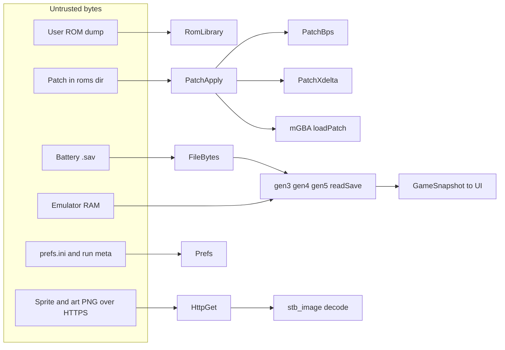

# Emulocke security audit, 14 September 2026

## Scope

Everything under `src/` plus the build (`CMakeLists.txt`, `cmake/`), the GitHub Actions workflow, and the way third-party code is consumed. Third-party sources themselves (mGBA, melonDS, Dear ImGui, xdelta3, stb_image, SDL3) were treated as trust boundaries, not audited line by line, except where sanitizers surfaced behaviour in them.

## Method

1. Parallel read-through of every subsystem (patching, save adapters, live memory, network, image decoding, filesystem, prefs, SDL and thread lifecycle, CI and dependency pinning) with a written finding per suspicious read, allocation, or ownership transfer.
2. Manual verification of each candidate against the code, then an adversarial unit test written to trigger it on the pre-fix tree under `-fsanitize=address,undefined`.
3. Fixes landed with the tests, then the sanitizer suite, `clang-tidy`, and 60 seconds of libFuzzer per harness were run over the result.

## Trust boundaries



Species names that reach `normalizeSlug` come from compiled-in tables today, but the slug is used to build filesystem paths and URLs, so it is treated as untrusted anyway.

## Findings

Status `fixed` means the fix and its regression test are in this change set. Files are the primary location; several fixes touch call sites elsewhere.

| ID | Severity | Component | Finding | Fix | Test | Status |
| --- | --- | --- | --- | --- | --- | --- |
| EMU-001 | Critical | `src/run/PatchBps.cpp` | BPS variable-length integer accumulated past `uint64_t`, the decoded target size was allocated unbounded, and SourceCopy/TargetCopy offsets were applied without range checks, giving heap overflow and out-of-bounds reads from a crafted patch | `BpsReader` caps VLI at 10 bytes and rejects overflow; target capped at `kMaxRomFile`; every command validated in `BpsCommands.cpp` with subtraction-form checks | `patch_bounds_check.cpp` | fixed |
| EMU-002 | Critical | `src/adapter/gen4/Save.cpp` | Size check covered `storageStart + 0x1000` but the reader then walked about 74 KiB of box data, so a truncated `.sav` read past the buffer | `gen4PartitionBytes(layout)` computes the true extent and the reader rejects anything shorter | `save_bounds_check.cpp` | fixed |
| EMU-003 | Critical | `src/adapter/gen45/Parse.cpp` | `parsePk45` decrypted `raw.size()` bytes into a fixed 236-byte stack array, a stack buffer overflow for oversized inputs | Reject `raw.size()` outside `[kPkStoredSize, kPk4PartySize]`; decrypt into the array's own span | `save_bounds_check.cpp` | fixed |
| EMU-004 | High | `src/emu/FileBytes.cpp` | `readWholeFile` allocated `tellg()` bytes with no cap and treated a failed `tellg()` (-1) as a huge size; `writeWholeFile` took `uint32_t` and truncated lengths | `readWholeFile(path, maxBytes)` with `FileLimits.hpp` caps at every call site; `writeWholeFile` takes `size_t` | `file_bytes_check.cpp` | fixed |
| EMU-005 | High | `src/run/PatchXdelta.cpp` | Decode retried with `XD3_ADLER32_NOVER` after a failure, so a patch whose target checksum did not match was applied silently; output growth was unbounded | Retry removed, checksum failure is final; output bounded by `kMaxRomFile` | `patch_format_check.cpp`, `patch_bounds_check.cpp` | fixed |
| EMU-006 | High | `src/cart/GameArtPng.cpp` | `stb_image` decoded any declared dimensions, so a small PNG could demand gigabytes | `STBI_MAX_DIMENSIONS 4096`, encoded size capped at `kMaxImageFile`, dimensions checked against `kMaxImageSide`, buffer owned by `unique_ptr` | `media_check.cpp` | fixed |
| EMU-007 | High | `src/application/SessionControl.cpp` | `shutdown()` called `SDL_Quit()` while textures, audio, and gamepad members were still alive, so their destructors ran against a torn-down SDL | `SdlRuntime` RAII member declared first in `Application`; explicit `SDL_Quit()` removed | `lifetime_check.cpp` | fixed |
| EMU-008 | High | `src/application/Host.cpp` | `SDL_Window*` leaked when `SDL_CreateRenderer` failed; raw owning handles throughout | `unique_ptr` with `SdlWindowDeleter` and `SdlRendererDeleter` | `lifetime_check.cpp` | fixed |
| EMU-009 | High | `src/application/Prefs.cpp` | `std::atoi` on `prefs.ini` values (undefined on overflow) and no clamping of window size, volume, scale, or speed | `PrefsParse.cpp` uses `std::from_chars` and clamps every numeric preference | `prefs_check.cpp` | fixed |
| EMU-010 | Medium | `src/poke/HttpGet.cpp` | No body size cap, any protocol accepted on redirect, unlimited redirects | 16 MiB cap in the write callback and `CURLOPT_MAXFILESIZE_LARGE`, `https` only for initial and redirect protocols, `CURLOPT_MAXREDIRS 5` | none offline (needs network); options reviewed | fixed |
| EMU-011 | Medium | `src/poke/SpriteIndex.cpp` | `normalizeSlug` stripped two characters and passed everything else through, so `/`, `\`, `..` could reach path and URL construction | Allowlist `[a-z0-9-]`, separators collapse to one hyphen | `slug_check.cpp` | fixed |
| EMU-012 | Medium | `src/emu/NdsSession.cpp` | Main RAM bounds check in addition form (`off + len <= size`) and any address at or above `0x02000000` was masked into main RAM | Subtraction form; only the `0x02xxxxxx` region is served from the RAM block, everything else goes through the bus | none offline (needs an NDS ROM); `boot_roms_check` covers it when ROMs are present | fixed |
| EMU-013 | Medium | `src/emu/NdsPlatformFiles.cpp` | `GetLocalFilePath` joined any relative name onto the pref dir, so a `..` segment escaped it | Moved to `NdsPlatformLocal.cpp`; names containing a `..` segment resolve to empty and every `*Local*` entry point fails closed | `local_files_check.cpp` | fixed |
| EMU-014 | Medium | `src/emu/AudioOutput.hpp` | `muted_`, `volume_`, `dropping_` plain fields read by `push()` and written from the UI thread | `std::atomic` | `lifetime_check.cpp` | fixed |
| EMU-015 | Medium | `src/application/SessionControl.cpp` | Emulator thread reread and reparsed the whole battery file every frame (up to 16 MiB after EMU-004), a trivial local denial of service and a large steady-state cost | `BatteryWatch` rereads only when mtime or size changes | `battery_watch_check.cpp` | fixed |
| EMU-016 | Low | `src/adapter/gen5/Save.cpp` | Minimum save size was an incidental `kGen5Trainer + 0x30` that happened to cover the party and boxes | Explicit `kGen5MinSave` derived from every region read | `save_bounds_check.cpp` | fixed |
| EMU-017 | Low | `src/emu/GbaSession.cpp` | `mCoreConfigInit` never paired with `mCoreConfigDeinit`; `VFile` leaked when `loadROM` failed (both found by LeakSanitizer) | Deinit in the destructor; close the handle on the failure path | `gba_host_check` under LSan | fixed |
| EMU-018 | Low | `.github/workflows/build.yml` | Actions referenced by floating tags; build artifacts uploaded for `pull_request` events too | Pinned to commit SHAs (`actions/checkout` v4.4.0, `msys2/setup-msys2` v2.32.0, `actions/upload-artifact` v4.6.2); upload gated on `push` | CI | fixed |
| EMU-019 | Low | `CMakeLists.txt` | `FetchContent` for SDL3 and dirent used moving tags | Pinned to commit SHAs | build | fixed |
| EMU-020 | Low | build | No hardening flags, no sanitizer build, no static analysis, no fuzzing | `cmake/Hardening.cmake`, `cmake/Sanitizers.cmake`, `cmake/Fuzzing.cmake`, `.clang-tidy`, three new CI jobs | CI | fixed |
| EMU-021 | High | `src/run/PatchXdelta.cpp` | xdelta3 allocated the VCDIFF app header (and other stream buffers) from a patch-controlled VLI with no cap, so ASan aborted `fuzz_xdelta` with allocation-size-too-big (~505 TiB) | Stream decode with a custom `xd3_alloc` that returns null when `items * size` exceeds `kMaxRomFile` | `patch_format_check.cpp`, corpus `fuzz_xdelta/appheader` | fixed |

## Residual risk

- **Third-party undefined behaviour.** xdelta3 performs intentional unaligned loads in its checksum, uses the `&((T*)0)->member` offsetof idiom, and `memcpy`s from a null `next_out` when a window produces no output. The xdelta3 target compiles with `-fno-sanitize=alignment,null,object-size,pointer-overflow,nonnull-attribute` under `EMULOCKE_SANITIZE=address`; everything else in that library stays instrumented. mGBA and melonDS are instrumented in full.
- **xdelta fail-closed.** EMU-005 removes a fallback that may have existed because a bundled hack's patch failed Adler32 against its catalogued base. Bundled ROMs are not available in this environment. If a hack stops patching, regenerate the patch against the correct base rather than reinstating the retry.
- **`_GLIBCXX_ASSERTIONS`.** Any remaining out-of-range `operator[]` in project code now aborts instead of corrupting memory. This is deliberate and changes the failure mode from silent to loud.
- **Emulator RAM.** Adapters read live memory through `LiveMemory::read`, which is bounds-checked against the RAM block or routed through the emulator bus. Pointers read from RAM (for example the Gen4 save pointer) are only used as further read addresses, never as host pointers.
- **clang-tidy baseline.** The checks excluded from `WarningsAsErrors` in `.clang-tidy` still have pre-existing hits (widening multiplications in bounded loops, `int` to `float` narrowing in UI layout, C-API ownership at the SDL/melonDS/mGBA boundary). They run as warnings; every other enabled check is an error. Shrink the exclusion list as those are cleaned up.
- **Windows.** The sanitizer, tidy, and fuzz jobs run on Linux only. Windows builds get the hardening flags through MinGW but no sanitizer coverage.

## Running the checks locally

```
# Release build and tests
cmake -B build -G Ninja -DCMAKE_BUILD_TYPE=Release
cmake --build build --parallel && ctest --test-dir build --output-on-failure

# ASan + UBSan (GCC or Clang)
cmake -B build-asan -G Ninja -DCMAKE_BUILD_TYPE=Debug -DEMULOCKE_SANITIZE=address
cmake --build build-asan --parallel && ctest --test-dir build-asan --output-on-failure

# clang-tidy over project sources
run-clang-tidy -p build-asan -quiet "^$PWD/src/"

# libFuzzer (Clang only), 60 seconds per harness
cmake -B build-fuzz -G Ninja -DCMAKE_BUILD_TYPE=Debug \
  -DCMAKE_C_COMPILER=clang -DCMAKE_CXX_COMPILER=clang++ \
  -DEMULOCKE_SANITIZE=address -DEMULOCKE_FUZZ=ON
cmake --build build-fuzz --parallel --target fuzzers
tools/fuzz/smoke.sh build-fuzz 60

# regenerate seed corpora after changing a fixture builder
cmake --build build-fuzz --target emulocke-fuzz-seeds && ./build-fuzz/emulocke-fuzz-seeds src/fuzz/corpus
```

`EMULOCKE_SANITIZE=thread` is also accepted for a TSan build; it is not run in CI.

## Mandate going forward

`.cursor/rules/securitystandards.mdc` applies to every C++ change and points at the vendored skills under `.cursor/skills/` (`cpp-coding-standards`, `cpp-sanitizers`, `memory-safety-patterns`). Parser changes ship an adversarial test and a fuzz seed; nothing is done until the sanitizer suite and `clang-tidy` are clean.
